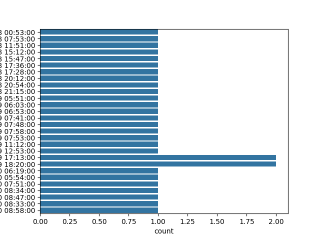
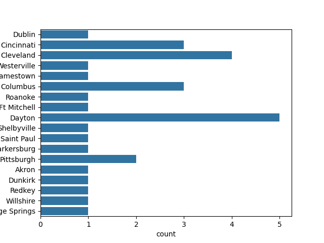
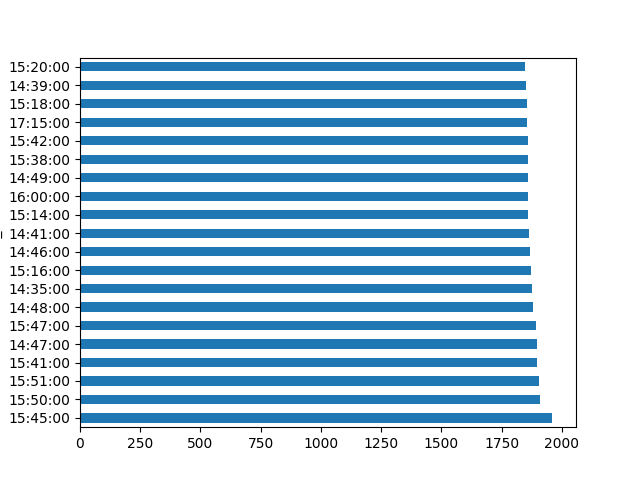
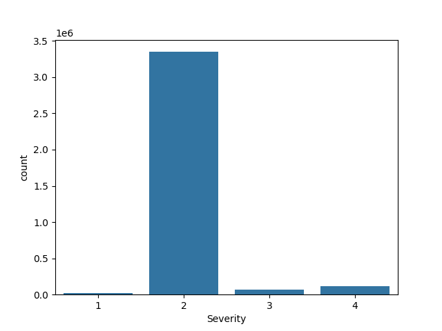
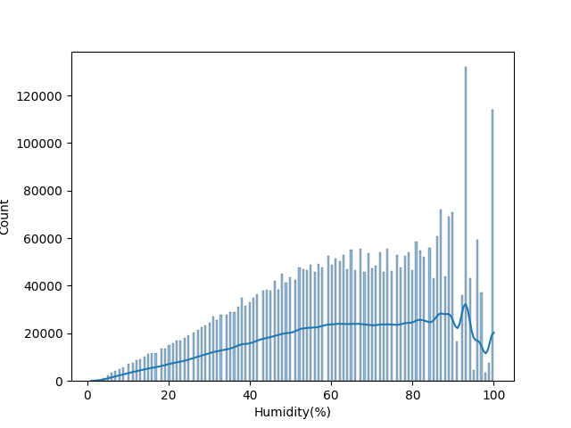

# US Accidents Data Analysis

This project analyzes the US Accidents dataset to explore various aspects such as accident severity, weather conditions, time of occurrence, and more. The analysis is performed using Python, with visualizations created using Seaborn and Matplotlib.

## Table of Contents

- [Overview](#overview)
- [Dataset](#dataset)
- [Installation](#installation)
- [Usage](#usage)
- [Functions Overview](#functions-overview)
- [Results](#results)
- [License](#license)

## Overview

The primary goal of this project is to explore and analyze the US Accidents dataset. The analysis includes data cleaning, exploratory data analysis (EDA), and hypothesis testing. Key insights are visualized using various plots and charts.

## Dataset

The dataset used in this project is the US Accidents (March 23) dataset, which contains data on accidents in the United States from February 2016 to March 2023. The data includes various features such as accident severity, weather conditions, and time of occurrence.

## Installation

To run this project locally, follow these steps:

1. Clone this repository to your local machine:
   ```bash
   git clone https://github.com/Slayerma/PRODIGY_DS_05.git
   ```

2. Navigate to the project directory:
   ```bash
   cd PRODIGY_DS_05
   ```

3. Create a virtual environment and activate it:
   ```bash
   python3 -m venv venv
   source venv/bin/activate  # On Windows use `venv\Scripts\activate`
   ```

4. Install the required packages:
   ```bash
   pip install -r requirements.txt
   ```

## Usage

You can run the analysis by executing the `Task05py` script:

```bash
python main.py
```

This will perform data cleaning, visualization, and hypothesis testing on the US Accidents dataset.

## Functions Overview

- **`load_and_clean_data()`**: Loads the dataset, drops missing values, and cleans the data.
- **`explore_data(df)`**: Provides an initial exploration of the dataset, including shape, null values, and basic statistics.
- **`visualize_weather_timestamps(df)`**: Visualizes the distribution of weather timestamps.
- **`visualize_cities(df)`**: Visualizes the distribution of accidents by city.
- **`time_of_accident_analysis(df)`**: Analyzes and visualizes the time of day when accidents occur.
- **`accident_severity_analysis(df)`**: Analyzes and visualizes accident severity.
- **`hypothesis_testing(df)`**: Conducts hypothesis testing on various features such as day/night, weather conditions, and temperature.

## Results

Here are some visualizations and insights derived from the analysis:

### 1. Weather Timestamp Distribution


### 2. Accident Distribution by City


### 3. Time of Accident Analysis


### 4. Accident Severity Analysis


### 5. Weather Condition Analysis


### 6. Hypothesis Testing Results


## License

This project is licensed under the MIT License. See the [LICENSE](LICENSE) file for more details.